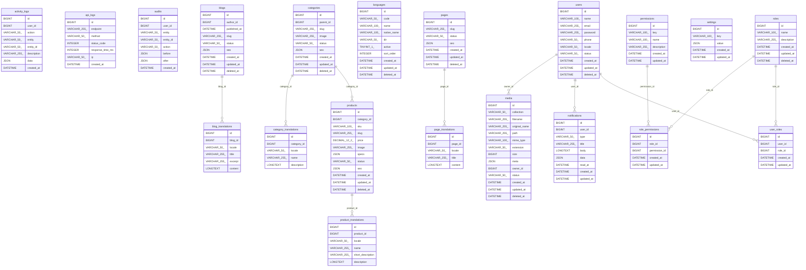

# Entity Relationship Diagram

> Generated by `php cli erd` from database/schema.

```mermaid
erDiagram
    activity_logs {
        BIGINT id
        BIGINT user_id
        VARCHAR_50_ action
        VARCHAR_50_ entity
        VARCHAR_50_ entity_id
        VARCHAR_255_ description
        JSON data
        DATETIME created_at
    }
    api_logs {
        BIGINT id
        VARCHAR_255_ endpoint
        VARCHAR_50_ method
        INTEGER status_code
        INTEGER response_time_ms
        VARCHAR_50_ ip
        DATETIME created_at
    }
    audits {
        BIGINT id
        BIGINT user_id
        VARCHAR_50_ entity
        VARCHAR_50_ entity_id
        VARCHAR_50_ action
        JSON before
        JSON after
        DATETIME created_at
    }
    blog_translations {
        BIGINT id
        BIGINT blog_id
        VARCHAR_50_ locale
        VARCHAR_255_ title
        VARCHAR_255_ excerpt
        LONGTEXT content
    }
    blogs {
        BIGINT id
        BIGINT author_id
        DATETIME published_at
        VARCHAR_255_ slug
        VARCHAR_50_ status
        JSON seo
        DATETIME created_at
        DATETIME updated_at
        DATETIME deleted_at
    }
    categories {
        BIGINT id
        BIGINT parent_id
        VARCHAR_255_ slug
        VARCHAR_255_ image
        VARCHAR_50_ status
        JSON seo
        DATETIME created_at
        DATETIME updated_at
        DATETIME deleted_at
    }
    category_translations {
        BIGINT id
        BIGINT category_id
        VARCHAR_50_ locale
        VARCHAR_255_ name
        LONGTEXT description
    }
    languages {
        BIGINT id
        VARCHAR_50_ code
        VARCHAR_100_ name
        VARCHAR_100_ native_name
        VARCHAR_50_ dir
        TINYINT_1_ active
        INTEGER sort_order
        DATETIME created_at
        DATETIME updated_at
        DATETIME deleted_at
    }
    media {
        BIGINT id
        VARCHAR_50_ collection
        VARCHAR_255_ filename
        VARCHAR_255_ original_name
        VARCHAR_255_ path
        VARCHAR_100_ mime_type
        VARCHAR_50_ extension
        BIGINT size
        JSON meta
        BIGINT owner_id
        VARCHAR_50_ status
        DATETIME created_at
        DATETIME updated_at
        DATETIME deleted_at
    }
    notifications {
        BIGINT id
        BIGINT user_id
        VARCHAR_50_ type
        VARCHAR_255_ title
        LONGTEXT body
        JSON data
        DATETIME read_at
        DATETIME created_at
        DATETIME updated_at
    }
    page_translations {
        BIGINT id
        BIGINT page_id
        VARCHAR_50_ locale
        VARCHAR_255_ title
        LONGTEXT content
    }
    pages {
        BIGINT id
        VARCHAR_255_ slug
        VARCHAR_50_ status
        JSON seo
        DATETIME created_at
        DATETIME updated_at
        DATETIME deleted_at
    }
    permissions {
        BIGINT id
        VARCHAR_100_ key
        VARCHAR_100_ name
        VARCHAR_255_ description
        DATETIME created_at
        DATETIME updated_at
    }
    product_translations {
        BIGINT id
        BIGINT product_id
        VARCHAR_50_ locale
        VARCHAR_255_ name
        VARCHAR_255_ short_description
        LONGTEXT description
    }
    products {
        BIGINT id
        BIGINT category_id
        VARCHAR_100_ sku
        VARCHAR_255_ slug
        DECIMAL_12_2_ price
        VARCHAR_255_ image
        JSON specs
        VARCHAR_50_ status
        JSON seo
        DATETIME created_at
        DATETIME updated_at
        DATETIME deleted_at
    }
    role_permissions {
        BIGINT id
        BIGINT role_id
        BIGINT permission_id
        DATETIME created_at
        DATETIME updated_at
    }
    roles {
        BIGINT id
        VARCHAR_100_ name
        VARCHAR_255_ description
        DATETIME created_at
        DATETIME updated_at
        DATETIME deleted_at
    }
    settings {
        BIGINT id
        VARCHAR_100_ key
        JSON value
        DATETIME created_at
        DATETIME updated_at
    }
    user_roles {
        BIGINT id
        BIGINT user_id
        BIGINT role_id
        DATETIME created_at
        DATETIME updated_at
    }
    users {
        BIGINT id
        VARCHAR_100_ name
        VARCHAR_255_ email
        VARCHAR_255_ password
        VARCHAR_50_ phone
        VARCHAR_50_ locale
        VARCHAR_50_ status
        DATETIME created_at
        DATETIME updated_at
        DATETIME deleted_at
    }
    blogs ||--o{ blog_translations : "blog_id"
    categories ||--o{ category_translations : "category_id"
    users ||--o{ media : "owner_id"
    users ||--o{ notifications : "user_id"
    pages ||--o{ page_translations : "page_id"
    products ||--o{ product_translations : "product_id"
    categories ||--o{ products : "category_id"
    roles ||--o{ role_permissions : "role_id"
    permissions ||--o{ role_permissions : "permission_id"
    users ||--o{ user_roles : "user_id"
    roles ||--o{ user_roles : "role_id"
```
