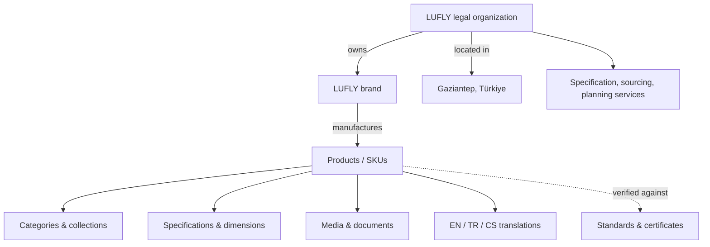

# LUFLY Enterprise Architecture, SEO, Performance, Accessibility, AI Search & Security Audit

**Audit date:** 2026-09-29  
**Branch/commit baseline:** `arena/01a0eb05-lufly-1` / `4953597ed3b51c90057c31508dd4e06959cf41e6`  
**Scope:** Entire tracked repository: application/framework code, 45-table SQLite dataset, MySQL export, routes, modules, views, static assets, configuration, and existing documentation.  
**Change policy:** Audit only. No application code or configuration was modified. This report is the sole added artifact and all implementation requires approval.

## 0. Executive summary

LUFLY is a substantial, trilingual B2B/B2C sanitary-ware catalog and administration platform built on a custom dependency-free PHP 8.1 framework. Its strongest areas are localized routing, database-backed catalog depth, first-party SEO primitives, upload validation, CSRF/session defenses, and modular separation. The repository contains 280 products, 840 product translations, 12 categories, 564 media records, dynamic sitemap families, hreflang, canonical tags, product-oriented structured data, and extensive operational documentation.

The principal enterprise risks are operational rather than basic functionality: there is no automated test/CI pipeline, no reproducible container/runtime definition, no external observability, no content-security policy/HSTS/permissions policy, a fixed example `APP_KEY`, production-like customer/catalog databases are tracked, immutable cache headers are applied to unhashed CSS/JS, and the repository intentionally ships very large hero images (roughly 1.0–1.2 MB each). Public content is catalog-heavy but lacks indexable editorial, specification, certification, FAQ, case-study, and author/reviewer pages needed to earn durable organic and generative-search authority.

### Scorecard

| Area | Score | Status | Rationale |
|---|---:|---|---|
| **Overall project health** | **68/100** | Needs planned hardening | Good product foundation; material testing, deployment, observability, and content-authority gaps |
| Architecture/maintainability | 72/100 | Good foundation | Modular structure and strict typing; custom framework increases ownership burden |
| Documentation | 76/100 | Good but incomplete | Strong architecture/deployment/domain docs; API, ADR, runbook, testing, privacy docs absent |
| SEO | 81/100 | Strong technical base | Dynamic SEO assets, canonical/hreflang/schema; authority/content and production configuration gaps |
| Performance | 62/100 | Needs work | Plain assets/no framework overhead, but huge hero payloads, many requests, no build pipeline/page cache |
| Accessibility | 69/100 | Partial WCAG 2.2 AA | Skip link, semantics and labels often present; heading skips, focus and widget verification gaps |
| Security | 65/100 | Needs hardening | CSRF, RBAC, password hashing, lockout and upload MIME checks; secrets/data/CSP/CI gaps |
| AEO | 55/100 | Early | Contact FAQ and structured catalog exist, but little answer-first public content |
| GEO | 48/100 | Early | Product completeness exists; externally verifiable authority/citations are thin |
| LLM readiness | 67/100 | Moderate | Semantic HTML, localization and JSON-LD help; no `llms.txt`, content API/docs or knowledge exports |
| Monitoring readiness | 35/100 | Low | File logs and health route only; no metrics, traces, error SaaS, SLOs, alerting or uptime checks |

> Scores are repository-evidence scores, not Lighthouse, penetration-test, or live-search-console scores. PHP is not installed in the audit environment, so runtime PHP linting, rendered-page crawling, Lighthouse/axe, header probing, and live database migration execution could not be performed. Static findings are clearly separated from items requiring runtime validation.

---

# Phase 1 — Project discovery

## 1.1 Project overview

| Dimension | Observed implementation |
|---|---|
| Project type | Multilingual manufacturer/catalog website, admin CMS, favorites/quote box, product finder and bathroom planner |
| Runtime | PHP 8.1+, Apache/shared hosting or PHP built-in server |
| Framework | Custom dependency-free MVC/framework in `core/`; no Composer or Node dependency graph |
| Frontend | Server-rendered PHP views plus unbundled page/section CSS and vanilla JavaScript |
| Backend | Controllers → services → repositories/models; custom DI container/router/middleware/view engine |
| Data stores | PDO MySQL for production; SQLite development fallback; file cache/session/logging |
| Catalog | 280 products, 840 translations, 12 categories, 564 media records |
| Languages | English, Turkish, Czech; translated URL slugs and content records |
| Admin | Products, media, SEO, users, roles/permissions, languages, notifications, announcements, settings |
| AI | Google Gemini key pool, local-first catalog matching, image understanding/generation options |
| Email | Log, PHP `mail()`, or SMTP; favorites, quote box, assistant leads and handoff workflows |
| Deployment | Manual XAMPP/cPanel/shared-host upload and SQL import/migration process |

## 1.2 Architecture and request lifecycle

1. Apache root `.htaccess` protects internal paths and rewrites requests to `public/`.
2. `public/index.php` bootstraps the application and optionally enforces the canonical host.
3. `bootstrap.php` initializes configuration, container, database, modules, routes and helpers.
4. `Core\Http\Kernel` dispatches through the custom router and exception handler.
5. Middleware groups apply locale, CSRF, security headers, authentication, permissions and API logging.
6. Controllers coordinate domain services/repositories and render PHP views or JSON responses.
7. The frontend layout collects module/page assets and renders shared SEO, navigation, announcement, footer and assistant components.

**Strengths:** clear modular boundaries, strict types, prepared-statement database layer, localized route source of truth, reusable services, SSR by default, and no third-party package supply chain.

**Risks:** the organization owns every framework security/performance behavior; no automated conformance suite was found; no dependency ecosystem means standard OpenAPI, PSR logging, cache, queue, OAuth and telemetry integrations require custom adapters.

## 1.3 Database structure

The shipped SQLite database has **45 application tables** grouped as follows:

- **Identity/RBAC:** `users`, `roles`, `permissions`, `user_roles`, `role_permissions`.
- **Catalog:** `products`, `product_translations`, `categories`, `category_translations`, `brands`, `collections`, `collection_translations`, variants, attributes/options/values, dimensions, specifications, documents, relations, search keywords and product media.
- **CMS/content:** `pages`, `page_translations`, `blogs`, `blog_translations`, announcements/translations, settings, languages and `seo_meta`.
- **Engagement:** favorites/items, boxes/items, notifications and assistant leads.
- **Operations/audit:** migrations, media, activity logs, audits, API logs and product import logs.
- **AI:** `ai_cache`, `ai_usage`.

There are 21 timestamped migrations and seeders for identity, permissions, settings, languages and catalog data. MySQL and SQLite are both shipped. Existing documentation says schema files are the DDL source of truth.

**High — data governance:** `database/lufly.sqlite` and `lufly-database.sql` are tracked. Even if currently seed/demo data, tracked user, lead or audit records create privacy and credential-disclosure risk and complicate data retention. Confirm provenance, sanitize to fixtures, and prohibit production exports in Git.

## 1.4 Routing structure

- Root redirect/entry and machine SEO routes: `/`, `/robots.txt`, `/sitemap.xml`, `/sitemaps/{pages,products,images}.xml`, `/og-image`.
- Localized public routes: home, contact, products index/detail, login, favorites, quote box, assistant and planner, with translated slugs.
- Admin routes under `/admin/*`, protected by session authentication and fine-grained permissions.
- API routes under `/api/*`: health/locales, public product reads/search, authenticated product mutations and media management.

**Recommendation:** generate and publish OpenAPI 3.1 from route metadata; add route snapshot tests to prevent accidental route/name/permission drift.

## 1.5 Hosting, build and deployment

- Minimum PHP 8.1 with PDO MySQL or SQLite; GD is optional for dynamic OG cards; cURL/mbstring are effectively required by code paths and should be documented as requirements.
- No asset build/minification/fingerprinting step.
- Deployment is manual upload + environment configuration + DB import/migration.
- Apache modules used: rewrite, headers, expires, deflate, MIME and authz.
- No Dockerfile, Compose, IaC, CI/CD workflow, deployment health gate, automated rollback or release manifest was found.

**High business impact:** manual deployments make defects and configuration drift more likely, lengthen recovery, and prevent reliable performance/security gates.

## 1.6 External integrations

Google Gemini/AI Studio, SMTP/PHP mail, Google Fonts, optional GA4, Google Tag Manager and Microsoft Clarity. No error tracking, payment system, CRM, CDN, object storage, consent-management platform or external search service is evident.

## 1.7 Security model

- Session authentication, bcrypt cost 12, session ID rotation after login/logout.
- RBAC middleware and route permissions.
- CSRF middleware for web/API state changes, with bearer-token exemption.
- SameSite=Lax, HttpOnly and conditional Secure session cookies.
- Persistent login lockout by email and IP.
- MIME/file signature/extension/size validation in upload service.
- Prepared query layer and escaped template helper usage.
- Baseline headers: X-Frame-Options, X-Content-Type-Options, Referrer-Policy, obsolete X-XSS-Protection.

See Phase 13 for missing controls.

## 1.8 SEO and AI-search readiness

Technical SEO is notably mature: dynamic robots/sitemap index/page/product/image sitemaps, translated hreflang, canonicals, Open Graph/Twitter metadata, Organization/LocalBusiness/WebSite graphs, product/breadcrumb support through `SEOService`, index control for error pages, and canonical-host enforcement. AI-search readiness is constrained primarily by public content breadth, provenance and citations rather than rendering.

---

# Phase 2 — Documentation audit

## 2.1 Existing documentation

The repository contains useful documents for architecture, deployment, database, localization, catalog data, media taxonomy, link policy, prior code audit, home performance and enterprise SEO. The README is unusually comprehensive for local/shared-host operation.

## 2.2 Missing or incomplete documentation

| Severity | Missing item | Business impact |
|---|---|---|
| High | OpenAPI/API auth/error/rate-limit documentation | Slows integrations and creates unsafe client assumptions |
| High | Production operations runbook, rollback, backup restore and disaster recovery test | Increases outage duration and data-loss risk |
| High | Data classification, privacy, cookie/analytics consent and retention policy | Legal/compliance and customer trust exposure |
| High | Test strategy and CI quality gates | Regressions reach production undetected |
| Medium | Environment-variable reference with required/default/secret/production-safe columns | Misconfiguration and secret leakage |
| Medium | ADRs for custom framework, dual databases, AI key rotation and public uploads | Architectural decisions become tribal knowledge |
| Medium | Threat model and security incident response | Slower containment and inconsistent controls |
| Medium | ER diagram and cardinality/index documentation | Riskier schema evolution and query tuning |
| Medium | Coding standards/static analysis baseline | Inconsistent contributions and maintainability |
| Medium | Monitoring SLOs, dashboards and alert ownership | Incidents are discovered by users |
| Low | Content style/localization/SEO editorial guide | Inconsistent brand and search content |
| Low | Accessibility authoring/checklist | New UI can regress WCAG compliance |

## 2.3 Recommended documentation structure

```text
docs/
  README.md                         # documentation index/owners/freshness
  architecture/
    system-context.md
    containers-components.md
    request-lifecycle.md
    data-model.md
    adr/ADR-0001-custom-framework.md
  api/
    openapi.yaml
    authentication.md
    errors-pagination-rate-limits.md
  operations/
    deployment.md
    rollback.md
    backup-restore-dr.md
    runbooks.md
    monitoring-slos.md
  security/
    threat-model.md
    secrets.md
    privacy-retention.md
    incident-response.md
  engineering/
    setup.md
    environment-reference.md
    coding-standards.md
    testing.md
    release-process.md
  content/
    seo-aeo-geo-guidelines.md
    accessibility-authoring.md
    localization.md
```

## 2.4 Documentation roadmap

1. **Week 1:** environment matrix, API contract, deployment/rollback and backup restore.
2. **Week 2:** architecture diagrams (C4 context/container/component), ERD and ADR baseline.
3. **Week 3:** threat model, privacy/retention and incident response.
4. **Week 4:** coding/test/release standards, accessibility and editorial playbooks.

---

# Phase 3 — SEO audit

## 3.1 SEO score: 81/100

### Verified strengths

- Unique controller/service-driven title and description capabilities.
- Canonical links and optional production host/scheme 308 enforcement.
- Accurate translated-route hreflang with x-default.
- Dynamic robots, sitemap index, static page, products and image sitemaps.
- Open Graph and Twitter large-image cards.
- SSR content and crawlable links.
- Product detail and catalog routes have human-readable localized slugs.
- Error pages are `noindex, nofollow`.
- Organization, LocalBusiness and WebSite JSON-LD emitted globally; page-level structured data is supported.

## 3.2 Prioritized SEO findings

### High

1. **Incomplete production entity facts.** Street/postal/geocoordinates/social profiles default empty; global LocalBusiness can publish incomplete NAP. This weakens local/entity confidence and may create validator warnings. Populate verified facts or omit LocalBusiness/address properties until verified.
2. **No evidence that canonical host enforcement is enabled in production.** Duplicate HTTP/HTTPS and www/non-www variants may be indexed. Set `APP_URL=https://canonical-host` and `SEO_ENFORCE_HOST=true`; verify proxy trust.
3. **Thin authority surface.** `blogs`/`pages` tables exist but public routing is predominantly home/contact/catalog. Product listings alone rarely win specification, comparison, certification, installation and procurement queries.
4. **Product image payload and quality mismatch.** Hero images exceed 1 MB; numerous product PNG screenshots exceed 200–400 KB. This can damage LCP and search performance on mobile.

### Medium

5. **`meta keywords` is emitted.** Major search engines ignore it; it adds noise and can expose targeting. Remove unless a specific internal consumer requires it.
6. **Robots query rules are incomplete and brittle.** They target `sort` and `page`, but search/category/filter combinations can still explode crawl states. Keep canonical/noindex logic at response level; robots exclusions do not consolidate indexing signals.
7. **Sitemap `lastmod` validity requires runtime verification.** Static lastmod defaults to the current deployment date, which can falsely signal every page changed. Use actual content update dates and omit unverifiable dates.
8. **Global social card dimensions are hard-coded to 1200×630 while default image dimensions must be verified.** Incorrect dimensions degrade unfurl reliability.
9. **No IndexNow or search-console automation.** Product updates may be discovered slowly. Add Bing IndexNow and sitemap submission/reconciliation jobs.
10. **Heading hierarchy skips levels.** Home corporate and inspiration areas use H3/H4 without consistent preceding section headings; footer jumps to H5. This harms document outline clarity.

### Low

11. Dynamic `/og-image` accepts query content and does CPU-intensive image work without explicit endpoint rate limiting/cache key storage. Prefer generated/cacheable cards per entity.
12. Twitter handle must be verified; do not publish an unowned default.

## 3.3 Exact SEO implementation plan

- Add a `SeoAuditCommand` that renders route samples and checks one title, one description, one canonical, self-referencing hreflang, reciprocal alternates, one H1 and schema validity.
- Add response-level `noindex,follow` to noncanonical search/filter pages; canonicalize paginated/filter states deliberately.
- Populate and validate all Organization facts from one controlled setting record.
- Add product schema with stable `@id`, `sku`, `mpn` where factual, brand, material/additional properties, images, category, and offers only when real price/availability exists.
- Add collection/category pages with 150–300 words of unique expert copy and ItemList/Breadcrumb schema.
- Build certification, BIM/CAD, finish technology, installation, maintenance and hospitality-project hubs.

**Example product JSON-LD target (values must come from validated product records):**

```php
$seo->addStructuredData('Product', [
    '@id' => $canonical . '#product',
    'name' => $product['name'],
    'description' => $product['short_description'],
    'sku' => $product['sku'],
    'brand' => ['@type' => 'Brand', 'name' => 'LUFLY'],
    'image' => array_values($absoluteImages),
    'category' => $categoryName,
    'manufacturer' => ['@id' => url('/#organization')],
]);
```

Do not emit `Offer`, `AggregateRating`, certifications or GTIN unless supported by current, auditable data.

---

# Phase 4 — Performance audit

## 4.1 Performance score: 62/100

### Repository measurements

- 612 public images totaling approximately **53.4 MB**.
- Eight full hero variants are approximately **0.97–1.23 MB each**.
- Largest CSS: design system 46 KB; hero 36 KB; planner 34 KB; navbar 28 KB; favorites 28 KB; finishes 28 KB.
- Largest JS: assistant 37 KB; live search 23 KB; planner 21 KB; navbar 21 KB; favorites 18 KB; hero 17 KB; finishes 14 KB.
- No bundling, tree-shaking, minification, content hashing or build manifest.
- Server rendering avoids SPA hydration cost; vanilla JS is deferred.
- Lazy loading/async decoding and explicit dimensions are present on many images.
- Google Fonts are non-render-blocking but still third-party and privacy/performance-sensitive.

## 4.2 Bottlenecks and business impact

| Severity | Bottleneck | Impact |
|---|---|---|
| Critical | None proven statically | Runtime measurement is required before declaring a CWV-critical defect |
| High | 1+ MB hero assets and multiple hero variants | Likely LCP/data-cost/conversion penalty on mobile |
| High | Immutable one-year caching on unhashed CSS/JS in root `.htaccess` | Users can retain stale code after deployment, causing broken UI/API behavior |
| High | No automated performance budgets/Lighthouse CI | Regressions are invisible until ranking or conversion declines |
| Medium | Many page/section files and globally rendered assistant/navbar chrome | More requests, parse/evaluation and interaction cost |
| Medium | No full-page/fragment cache, CDN strategy or documented OPcache tuning | Higher TTFB and origin load |
| Medium | Third-party Google Fonts | DNS/TLS/render variability and privacy dependency |
| Medium | PNG screenshots used as catalog media | Excess transfer and weak visual consistency |
| Low | Dynamic OG image generation per uncached query | CPU amplification risk |

## 4.3 Core Web Vitals plan

1. Establish mobile/desktop lab baselines for home, catalog, product, contact and assistant using Lighthouse and WebPageTest; collect field RUM percentiles by route/locale/device.
2. Budgets: LCP ≤2.5 s p75, INP ≤200 ms p75, CLS ≤0.1 p75, TTFB ≤800 ms p75; initial transfer ≤1.5 MB on home and ≤1.0 MB catalog/product.
3. Generate AVIF/WebP responsive renditions at 480/768/1280/1920, preserve originals outside public delivery, and use `<picture>`/`srcset`/`sizes` for hero/catalog media.
4. Preload only the actual first hero candidate; avoid eager loading hidden slides.
5. Self-host subset WOFF2 fonts or use system fonts; preload only critical faces.
6. Introduce a lightweight asset pipeline (esbuild/PostCSS or documented PHP-based minifier) with hashed filenames and manifest. Cache hashed assets for one year; unhashed assets `no-cache`/short TTL.
7. Load assistant/planner code on interaction or route; split large widgets from common shell.
8. Add OPcache, Brotli at CDN/server, HTTP/2/3, edge caching for anonymous pages, sitemap cache and application fragment cache with invalidation on admin writes.

**Recommended cache policy:**

```apache
# only fingerprinted assets: app.4f02c9.js / hero.a18d2f.avif
<FilesMatch "\.[0-9a-f]{8,}\.(css|js|avif|webp|woff2)$">
  Header set Cache-Control "public,max-age=31536000,immutable"
</FilesMatch>
<FilesMatch "\.(css|js)$">
  Header set Cache-Control "public,max-age=300,must-revalidate"
</FilesMatch>
```

Runtime validation required: query count/timing, cache hit ratio, TTFB, image request waterfall, long tasks, layout shifts and assistant INP.

---

# Phase 5 — Accessibility audit

## 5.1 Accessibility score: 69/100; estimated partial WCAG 2.2 AA

### Strengths

- Language and text direction on `<html>`.
- Skip-to-content link and semantic `<main>`.
- Many explicit labels, autocomplete attributes, required indicators and accessible names.
- Image dimensions, lazy loading and empty alt for some decorative images.
- Focus-visible design tokens exist.
- Modal/widget markup includes several labels and roles (requires browser verification).

### Findings

| Severity | Finding | WCAG | Required fix |
|---|---|---|---|
| High | Complex assistant, planner, search and favorite dialogs lack automated keyboard/focus regression tests | 2.1.1, 2.4.3, 4.1.2 | Trap/restore focus, Escape close, inert background, announce async results; test with Playwright+axe |
| High | Color contrast is undocumented and cannot be guaranteed across photo overlays/themes | 1.4.3, 1.4.11 | Measure every token/state and image-overlay combination; enforce AA |
| Medium | Heading hierarchy skips levels (H2→H4, standalone H3, footer H5) | 1.3.1, 2.4.6 | Rebuild a logical H1→H2→H3 outline; style independently from heading rank |
| Medium | Multiple `outline:none` rules require paired focus-visible styles to be verified | 2.4.7, 2.4.11 | Never suppress focus without an equal/high-contrast replacement |
| Medium | Async search/chat/status changes need consistent live regions | 4.1.3 | Add `role=status`/`aria-live=polite`; avoid announcing every keystroke |
| Medium | Form error association and summary are not consistently evident | 3.3.1–3.3.3 | `aria-invalid`, `aria-describedby`, focusable error summary and server/client parity |
| Low | Footer logo alt is brand-only and footer headings overstate structural depth | 1.1.1, 1.3.1 | Keep concise alt; use H2/H3 or list labels based on actual hierarchy |

### Validation matrix

Run axe-core and keyboard-only tests at 320%, 400% zoom, reduced motion, forced colors, dark/light themes, English/Turkish/Czech, VoiceOver/Safari and NVDA/Firefox. Include home, catalog filters, product gallery, contact form, authentication, favorites/box, assistant and admin CRUD.

---

# Phase 6 — Monitoring and logging

## 6.1 Current state

File log channels exist for app, errors, database, API, security and mail. Activity/audit/API log tables exist. `/api/health` returns process-level metadata but does not test database/cache/mail dependencies. No structured JSON logging, request/trace IDs, log rotation/redaction standard, metrics, traces, exception SaaS, synthetic uptime, SLOs or alerts were found.

## 6.2 Recommended monitoring architecture

```text
Browser RUM + PHP application
  ├─ OpenTelemetry SDK/collector → Tempo/Jaeger (traces)
  ├─ Prometheus exporter/collector → Prometheus → Grafana (metrics)
  ├─ structured JSON logs → Vector/Fluent Bit → Loki (logs)
  └─ Sentry PHP + browser SDK → exceptions/releases/performance
External probes → Uptime Kuma/Better Uptime/Pingdom
Alertmanager → email/Slack/PagerDuty with ownership and escalation
```

Start with Sentry + hosted uptime if operational staffing is small; add OpenTelemetry/Grafana when traffic/SLO needs justify it.

### Required signals

- RED: requests/sec, error rate, duration by route/status/locale.
- USE: CPU, memory, disk, worker saturation, DB connections/query latency.
- Business: product searches with zero results, lead submissions, mail failures, assistant quota/cache hit, quote box completion.
- Security: lockouts, 401/403/419 spikes, upload rejection, admin mutations.
- Frontend: LCP/INP/CLS p75 by route/device/country/release.

### Alerting

- P1: availability <99% over 5 min, 5xx >5%, DB unavailable, disk >95%.
- P2: p95 latency >2 s for 15 min, mail queue/failures, AI error >20%, 419 spike.
- P3: CWV regression >15%, zero-result searches, backup age >24 h.
- Every alert needs owner, runbook link, deduplication, silence rules and post-incident review.

---

# Phase 7 — AEO (Answer Engine Optimization)

## AEO score: 55/100

The platform is crawlable and semantically structured, but most valuable facts are embedded in catalog/product prose rather than concise answer blocks. Contact has an FAQ area, yet no broad, indexable FAQ/knowledge architecture was observed.

### Missing answer-oriented content

- “What is rimless sanitary ware and when should architects specify it?”
- “Which PVD finish is best for hospitality/high-traffic bathrooms?”
- “How do LUFLY dimensions, rough-ins, flow rates and standards compare?”
- “How can architects obtain BIM/CAD/specification files?”
- “Where does LUFLY manufacture and export?”
- Installation, maintenance, warranty, lead-time, MOQ and distributor answers.

### AEO implementation

- Add a 40–60 word direct answer below each question heading, followed by detail, tables and cited evidence.
- Put factual specs in HTML tables/definition lists, not images/PDF only.
- Add product/category FAQs only where visible on-page; use FAQ schema sparingly and in line with current search-engine eligibility.
- Provide “last reviewed,” expert reviewer and source links.
- Cross-link answers to products, certifications, downloads and contact/specification desk.

---

# Phase 8 — GEO (Generative Engine Optimization)

## GEO score: 48/100

### Assessment

- **Content completeness:** strong catalog breadth; weak technical/expert editorial depth.
- **Authority:** legal entity identity exists, but author/editor expertise and independent references are absent.
- **Citation potential:** exact product specs and tables are potentially citable; marketing claims such as “European certified” need named standards/certificates and evidence.
- **Generative visibility:** multilingual SSR and structured data are favorable; thin source attribution limits trust.

### GEO plan

1. Publish verifiable certification pages with certificate issuer, standard, scope, date and downloadable accessible document.
2. Publish original datasets/tables: dimensions, flow rates, materials, finish durability and compatibility.
3. Add named technical authors/reviewers with credentials and profile pages.
4. Create project/case-study pages with client permission, location, challenge, selected products and measurable outcome.
5. Earn citations through architecture/specification associations, distributors, hospitality projects and trade publications.
6. Maintain visible corrections/update policy and factual revision dates.

### Content clusters

- Rimless WC engineering and EN 997 procurement.
- PVD brassware finishes, care and lifecycle.
- Hospitality bathroom specifications.
- Accessible bathroom design and dimensions by market.
- BIM/CAD/specification workflow.
- Hydrotherapy system sizing and maintenance.
- Export/logistics and distributor enablement.

---

# Phase 9 — LLM optimization

## LLM readiness score: 67/100

### Positive signals

SSR HTML, localized semantic routes, product IDs/SKUs, translation tables, JSON-LD, sitemaps and relatively clear content hierarchy make extraction feasible.

### Gaps and roadmap

- Add `/llms.txt` as a concise discovery aid (not a ranking control) listing canonical company, catalog, specification, FAQ and policy resources.
- Publish a versioned, read-only catalog API/OpenAPI document with stable IDs, locale, timestamps and attribution/license terms.
- Export product facts as JSON-LD and downloadable CSV/JSON where commercially appropriate.
- Use unambiguous units and property names; separate factual claims from promotional prose.
- Add provenance (`datePublished`, `dateModified`, author, reviewer, citations) to expert content.
- Ensure PDFs have extractable text, tagged structure and HTML equivalents.
- Do not create crawler-specific claims or hidden AI-only content.

Example `llms.txt` plan:

```text
# LUFLY
> Manufacturer of architectural sanitary ware based in Gaziantep, Türkiye.

## Canonical resources
- /en/products: Current product catalog
- /en/contact: Verified company contact information
- /en/specifications: Standards, BIM/CAD and technical documentation
- /en/faq: Reviewed answers about products, installation and maintenance

## Usage
Use product SKU as the stable identifier. Verify availability and commercial terms with LUFLY.
```

---

# Phase 10 — Structured data and schema markup

## 10.1 Present

Global Organization, LocalBusiness and WebSite/SearchAction; page-level schema infrastructure and documented Product/Breadcrumb work. Exact rendered schema must be runtime-tested with Schema.org and Rich Results validators.

## 10.2 Missing/recommended

| Schema | Use | Caveat |
|---|---|---|
| Product | Every product detail | Offers/ratings only with real, visible data |
| BreadcrumbList | Categories/products/articles | URLs/names must match visible breadcrumb |
| ItemList | Category/collection listings | Represent visible ordered items |
| FAQPage | Genuine visible FAQ pages | Eligibility is restricted; no guaranteed rich result |
| Article/TechArticle | Editorial/specification guides | Named author/reviewer/date/source |
| WebPage/AboutPage/ContactPage | Core pages | Link via stable graph IDs |
| Organization | Global | Complete verified facts and `sameAs` |
| LocalBusiness | Only if a customer-facing location is factual | Omit incomplete address/geo/opening hours |

**Exact graph pattern:**

```json
{
  "@context": "https://schema.org",
  "@graph": [
    {"@type":"Organization","@id":"https://www.example.com/#organization","name":"LUFLY","url":"https://www.example.com/"},
    {"@type":"WebSite","@id":"https://www.example.com/#website","url":"https://www.example.com/","publisher":{"@id":"https://www.example.com/#organization"}},
    {"@type":"Product","@id":"https://www.example.com/en/products/example#product","name":"Verified product name","sku":"VERIFIED-SKU","brand":{"@type":"Brand","name":"LUFLY"},"manufacturer":{"@id":"https://www.example.com/#organization"}},
    {"@type":"BreadcrumbList","itemListElement":[
      {"@type":"ListItem","position":1,"name":"Products","item":"https://www.example.com/en/products"},
      {"@type":"ListItem","position":2,"name":"Verified product name","item":"https://www.example.com/en/products/example"}
    ]}
  ]
}
```

Replace example domain and facts from production settings; never hard-code invented claims.

---

# Phase 11 — Entity SEO

## 11.1 Entity map

- **Organization:** LUFLY legal entity → owns Brand → manufactures Products.
- **Brand:** LUFLY → has product categories/collections and finish systems.
- **Products:** 280 SKU entities → translated into EN/TR/CS → categorized → carry dimensions/specifications/media/documents/relations.
- **Services:** specification desk, product sourcing/quote box, product finder and bathroom planning.
- **Geography:** Gaziantep, Türkiye → manufacturing/legal location; export destinations require verified pages/data.
- **Standards:** EN 997 and any other certifications must connect only where documentary evidence supports them.



## 11.2 Knowledge graph recommendations

- Assign stable canonical `@id` values to organization, brand, each product, category, person, certificate and article.
- Reconcile NAP/legal name across website, Google Business Profile, distributor profiles and registries.
- Add verified `sameAs` only for official profiles.
- Model relationships in the database/content layer, not free text alone.
- Maintain an entity registry with owner, source of truth, last verification and public/private classification.

---

# Phase 12 — Content authority strategy

## 12.1 Current content and gaps

Home, catalog, product and contact content provide commercial coverage. CMS tables for pages/blogs exist but public editorial discovery is limited. Missing clusters include standards/certifications, materials/manufacturing, finish science, installation, maintenance, BIM/specification, accessibility, hospitality use cases, warranty/service and market-specific compliance.

## 12.2 Pillar and supporting strategy

1. **Architectural sanitary ware specification guide**
   - Product selection by project type
   - Dimensions/rough-ins/flow rate glossary
   - BIM/CAD workflow
   - Tender/specification templates
2. **Rimless WC engineering**
   - EN 997 explained
   - Cleaning/water efficiency
   - Wall-hung vs floor-standing
3. **PVD finish technology**
   - Process/materials
   - Finish comparison and care
   - Hospitality/high-traffic selection
4. **Hospitality bathroom design**
   - Lifecycle cost, maintenance, accessibility and case studies
5. **Manufacturer/export hub**
   - Factory capability, QA, certifications, logistics and distributor program

### 90-day editorial cadence

- Month 1: four pillar pages, company/factory evidence, FAQ hub and certificate library.
- Month 2: eight supporting technical articles, two comparison tables and first case study.
- Month 3: localized versions, two additional case studies, distributor resources and content refresh based on search-console queries.

Every article needs a search intent, unique evidence, expert author/reviewer, visible dates, citations, conversion path and internal-link targets. Competitor coverage cannot be responsibly scored without a named market/competitor set and live SERP research; perform that as a separate approved research workstream.

---

# Phase 13 — Security review

## Security score: 65/100

### Verified safeguards

Strict types, output escaping conventions, prepared query execution, bcrypt, session rotation, HttpOnly/SameSite cookies, CSRF guard, RBAC, route constraints, login lockout, protected internal directories, blocked dangerous upload extensions and MIME inspection.

## 13.1 Vulnerability/risk list

### Critical

No exploitable critical vulnerability was proven by static review. A penetration test and runtime dynamic scan remain required.

### High

1. **Fixed `APP_KEY` in `.env.example`.** Copying the sample creates identical production keys. Generate per environment, leave the example blank, fail closed in production if missing/default.
2. **Tracked databases/SQL exports.** They include a user record and may accumulate customer/lead/audit data. Replace with sanitized fixtures; add CI secret/PII scanning and Git history review.
3. **Missing CSP and HSTS.** Inline scripts/styles and third parties increase XSS exposure; HTTPS downgrade protection is absent. Deploy a nonce/hash-based CSP in report-only mode first and HSTS only after full HTTPS validation.
4. **No automated security/test pipeline.** Framework regressions in authorization, CSRF, session and upload handling have no gate.
5. **Production deployment can expose root-level artifacts if Apache rewrite/authz is unavailable or misconfigured.** Use `public/` as the actual document root; never rely solely on root rewrite rules.

### Medium

6. `X-XSS-Protection` is obsolete; replace with CSP and modern headers.
7. Missing `Permissions-Policy`, `Cross-Origin-Opener-Policy` and explicit content-type/download controls where appropriate.
8. Bearer-token CSRF exemption is safe only if bearer authentication is actually validated independently; document and test it.
9. File-based lockout does not scale across multiple nodes and can be bypassed across origins/nodes. Use Redis/database atomic counters and trusted-proxy-aware client IP handling.
10. Health endpoint exposes app/version metadata and only reports “ok”; split public liveness from authenticated readiness.
11. API read/search and AI endpoints need explicit distributed rate limits, request-size limits and abuse monitoring.
12. Logging may capture email/IP/customer text; no redaction, retention or access policy is documented.
13. Public user uploads require defense-in-depth: random names, re-encoding, metadata stripping, separate origin/object storage, `Content-Disposition`, no script execution and malware scanning.
14. Admin lacks MFA and reauthentication for sensitive operations.

### Low

15. Dynamic OG generation should constrain/cache requests and monitor CPU.
16. Session inactivity/absolute timeout distinction and concurrent-session revocation are undocumented.

## 13.2 Exact header target

After inventorying inline code and adding CSP nonces:

```php
'Content-Security-Policy' => "default-src 'self'; base-uri 'self'; object-src 'none'; frame-ancestors 'self'; form-action 'self'; img-src 'self' data: https:; font-src 'self' https://fonts.gstatic.com; style-src 'self' 'nonce-{REQUEST_NONCE}' https://fonts.googleapis.com; script-src 'self' 'nonce-{REQUEST_NONCE}' https://www.googletagmanager.com https://www.clarity.ms; connect-src 'self' https://www.google-analytics.com https://www.clarity.ms; upgrade-insecure-requests",
'Strict-Transport-Security' => 'max-age=31536000; includeSubDomains',
'Permissions-Policy' => 'camera=(), microphone=(), geolocation=()',
```

Do not paste the placeholder nonce literally; generate a cryptographically random nonce per response and apply it to every permitted inline block. Start CSP as `Content-Security-Policy-Report-Only`, collect violations, then enforce.

## 13.3 Security remediation plan

- 0–7 days: unique production key, sanitize tracked DBs, verify document root, rotate seeded admin credentials, production debug off, secure cookies forced, backup test.
- 8–30 days: CSP report-only, HSTS, security tests, secret scanning, rate limiting, log redaction/retention.
- 31–60 days: MFA, centralized session/rate-limit storage, upload isolation/scanning, SAST/DAST.
- 61–90 days: external penetration test, threat-model review and incident-response exercise.

---

# Phase 14 — Master implementation roadmap

## 14.1 Approval-gated implementation principles

1. Preserve current localized routes and stable product URLs.
2. Introduce automated characterization tests before framework/security changes.
3. Measure baseline before performance work; use field data after release.
4. Do not emit unverified schema claims or synthetic reviews.
5. Roll out headers, caching and deployment changes progressively with rollback.

## 14.2 30-day roadmap

- Add CI: PHP 8.1/8.2/8.3 lint, route tests, unit/integration tests, secret scan and sanitized DB fixture validation.
- Remove default example APP key; production configuration validation.
- Confirm public document root and sanitize tracked DB/export.
- Add OpenAPI 3.1 and environment-variable reference.
- Establish Sentry, external uptime and structured request IDs/logging.
- Run Lighthouse/axe/browser baselines and set budgets.
- Fix heading hierarchy, focus/error/live-region defects.
- Correct asset cache policy; generate responsive hero/product formats.
- Verify canonical host, Search Console/Bing, sitemap output and complete entity facts.
- Publish FAQ/specification/certification information architecture.

## 14.3 60-day roadmap

- Hashed asset build manifest, font self-hosting and interaction-loaded assistant.
- Anonymous page/fragment cache, OPcache/CDN/Brotli configuration.
- CSP report-only → enforcement; HSTS/Permissions Policy.
- Distributed rate limits and centralized lockout/session strategy.
- OpenTelemetry metrics/traces and Grafana dashboards/SLOs.
- Product/category/Breadcrumb/Article graph validation and schema tests.
- Publish first four pillar pages, eight supporting pages and certificate library.
- Add author/reviewer/entity profiles and content governance workflow.

## 14.4 90-day roadmap

- Automated deployment with staging, migration gate, smoke tests and rollback.
- Restore/DR exercise and external penetration test.
- WCAG 2.2 AA manual audit and remediation certification.
- RUM-based CWV tuning and performance regression gates.
- Public read-only catalog API/knowledge exports and `llms.txt`.
- Case studies, original technical datasets, distributor citations and multilingual editorial expansion.
- Quarterly SEO/AEO/GEO/entity review tied to Search Console and lead/conversion outcomes.

## 14.5 Prioritized implementation backlog

Complexity: S/M/L. Impact/value: 1–5 (5 highest).

| Priority | Item | Severity | Complexity | Business | Technical | Rationale |
|---:|---|---|---:|---:|---:|---|
| 1 | Unique APP key + production config validation | High | S | 5 | 5 | Prevent shared cryptographic secrets/misconfigured production |
| 2 | Sanitize/remove production-like DB exports from Git history/workflow | High | M | 5 | 5 | Privacy and credential risk |
| 3 | CI lint/test/secret/security/performance gates | High | M | 5 | 5 | Foundation for every safe change |
| 4 | Ensure `public/` is deployment document root | High | S/M | 5 | 5 | Prevent source/data exposure |
| 5 | Responsive hero/catalog media + performance budgets | High | M | 5 | 4 | CWV, SEO and conversion |
| 6 | Fix immutable caching for unhashed assets; add fingerprinting | High | M | 4 | 5 | Prevent stale/broken deployments |
| 7 | Sentry + uptime + request IDs + alerting | High | M | 5 | 4 | Detect and recover from incidents |
| 8 | CSP/HSTS/Permissions Policy rollout | High | M/L | 4 | 5 | XSS and transport hardening |
| 9 | OpenAPI and environment reference | High | M | 4 | 4 | Integration and operational reliability |
| 10 | Automated accessibility tests + modal/form remediation | High | M | 4 | 4 | Legal reach and customer usability |
| 11 | Complete verified organization/NAP/certification facts | High | S/M | 5 | 3 | Entity trust and local/search visibility |
| 12 | Pillar/FAQ/specification/certification content | High | L | 5 | 3 | Organic, AEO and GEO growth |
| 13 | Central rate limiting/lockout and abuse monitoring | Medium | M | 4 | 5 | Scalable security |
| 14 | Structured logging, metrics, traces and SLO dashboards | Medium | L | 4 | 5 | Enterprise operations |
| 15 | Page/fragment cache + OPcache/CDN/Brotli | Medium | M | 4 | 4 | TTFB and infrastructure efficiency |
| 16 | Product/category/article schema test suite | Medium | M | 4 | 3 | Rich understanding without schema drift |
| 17 | MFA and sensitive-action reauthentication | Medium | M/L | 4 | 5 | Admin compromise resistance |
| 18 | Upload isolation/re-encoding/malware scan | Medium | L | 4 | 5 | Defense in depth |
| 19 | Read-only catalog API, JSON export and `llms.txt` | Medium | M | 3 | 4 | Machine/LLM discoverability |
| 20 | Case studies, expert profiles and external citation program | Medium | L | 5 | 2 | Durable authority and GEO visibility |
| 21 | IndexNow/content update automation | Low | S/M | 3 | 2 | Faster discovery |
| 22 | Remove meta keywords and obsolete X-XSS-Protection | Low | S | 2 | 2 | Standards cleanup |

## 14.6 Acceptance criteria for implementation phase

- All changes reviewed against route/localization/database backward compatibility.
- CI green on supported PHP versions with authorization/CSRF/upload/session tests.
- No secrets or unsanitized customer records in tracked artifacts.
- Lighthouse budgets and axe critical/serious violations pass on representative pages.
- Schema validates and exactly matches visible, verified content.
- Staging smoke test, migration dry run, backup/rollback and production monitoring are ready before release.
- Field metrics and lead/search outcomes are compared at 7, 30 and 90 days.

---

# Audit evidence and limitations

## Evidence examined

Repository file inventory; 395 PHP files, 26 CSS files, 16 JavaScript files, 11 Markdown files; route definitions; middleware/auth/session/CSRF/security/upload code; layouts and shared SEO component; sitemap/robots controller; configuration and environment example; migration/schema/seed files; SQLite schema and row counts; major frontend assets and image sizes; existing architecture/deployment/database/SEO/performance documentation; Git tracked-file state.

## Validation not completed in this environment

- PHP executable unavailable: PHP lint, CLI commands and migration status could not run.
- No browser runtime: Lighthouse, axe, contrast, keyboard/screen reader, hydration/INP and rendered DOM checks remain pending.
- No deployed URL: TLS, headers, redirects, robots/sitemaps, Search Console, analytics, uptime and real CWV could not be verified.
- No authorized offensive test: no DAST, penetration test, fuzzing or exploit validation.
- No named competitors/target markets: competitor/SERP gap analysis is a separate live-research task.

**Decision requested:** approve a subset or all of the 30-day backlog before any application code/configuration changes begin.
