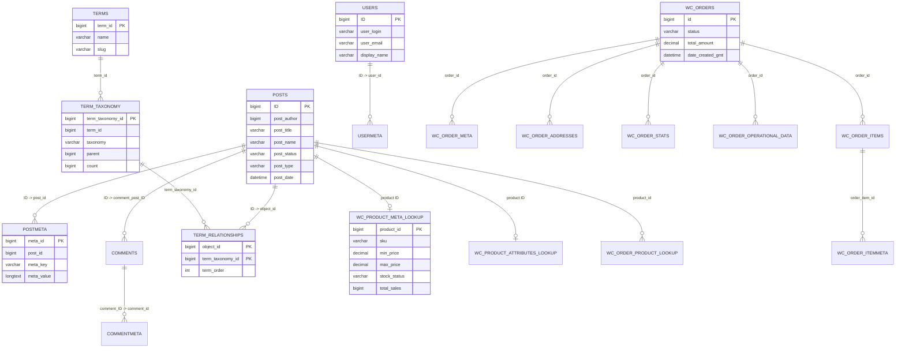

# lufly_new Database Schema

This document describes the local MySQL database `lufly_new`.

## Database identity

| Property | Value |
| --- | --- |
| Database | `lufly_new` |
| Engine | WordPress / WooCommerce |
| Table prefix | `chso_` |
| Site URL | `http://lufly.tr` |
| WordPress theme | `avanam` |
| Child stylesheet | `avanam-stoneware` |

The old system lives outside this repository; its structure-only SQL
dump (`lufly_new.sql`) was removed from the repo during cleanup and is
not shipped with the native application anymore.

## Important distinction

This is a separate database from the native PHP application's SQLite database:

- Native PHP application: [`database/lufly.sqlite`](../database/lufly.sqlite)
- WordPress/WooCommerce database: MySQL database `lufly_new`

The current native PHP storefront is configured to use SQLite in the local
[`.env`](../.env). It does not read `lufly_new` unless the application is
explicitly adapted to use MySQL and the WordPress data model.

## Product data path

WooCommerce products are stored using WordPress's generic content model:

```text
chso_posts
  post_type = 'product'
       |
       | ID = post_id
       v
chso_postmeta
  price, SKU, gallery, attributes, WooCommerce settings
       |
       +--> chso_wc_product_meta_lookup
       |      indexed SKU, prices, stock, ratings and sales
       |
       +--> chso_term_relationships
              |
              v
           chso_term_taxonomy --> chso_terms
           product_cat, product_tag, pa_* attributes
```

Current content snapshot:

- `280` published products
- `2` draft products
- `1` auto-draft product
- `1393` total rows in `chso_posts` across products, pages, revisions,
  attachments and plugin content
- `chso_wc_product_meta_lookup` contains `283` product index rows

## Logical ERD

WordPress normally relies on application-level relationships rather than
database-enforced foreign keys. The diagram below shows the logical links used
by WordPress and WooCommerce, not necessarily physical `FOREIGN KEY`
constraints.



## Table inventory

### WordPress core

| Table | Purpose |
| --- | --- |
| `chso_posts` | Pages, products, media attachments, revisions, menus and custom post types |
| `chso_postmeta` | Flexible key/value metadata for posts and products |
| `chso_options` | Site configuration, plugin settings and serialized options |
| `chso_users` | WordPress users |
| `chso_usermeta` | User roles and user metadata |
| `chso_comments` | Comments, reviews and pingbacks |
| `chso_commentmeta` | Comment/review metadata |
| `chso_terms` | Category, tag and attribute names |
| `chso_term_taxonomy` | Taxonomy type, description, hierarchy and usage count |
| `chso_term_relationships` | Links posts/products to taxonomy terms |
| `chso_termmeta` | Taxonomy term metadata |
| `chso_links` | Legacy WordPress links table |

### WooCommerce

| Table | Purpose |
| --- | --- |
| `chso_wc_product_meta_lookup` | Search/index table for product SKU, prices, stock, ratings and sales |
| `chso_wc_product_attributes_lookup` | Product and variation attribute index |
| `chso_wc_category_lookup` | Product category lookup |
| `chso_wc_tax_rate_classes` | Tax rate classes |
| `chso_wc_tax_rates` | Tax rates |
| `chso_wc_tax_rate_locations` | Country/state/postcode mapping for tax rates |
| `chso_wc_orders` | High-performance order records |
| `chso_wc_orders_meta` | Order metadata |
| `chso_wc_order_addresses` | Billing and shipping addresses |
| `chso_wc_order_operational_data` | Operational order data |
| `chso_wc_order_stats` | Reporting and order statistics |
| `chso_wc_order_product_lookup` | Order-to-product reporting links |
| `chso_wc_order_coupon_lookup` | Order-to-coupon reporting links |
| `chso_wc_order_tax_lookup` | Order tax reporting links |
| `chso_wc_order_items` | Line items within orders |
| `chso_woocommerce_order_itemmeta` | Metadata for order line items |
| `chso_woocommerce_sessions` | Customer/cart sessions |
| `chso_woocommerce_api_keys` | WooCommerce REST API keys |
| `chso_woocommerce_attribute_taxonomies` | Registered global product attributes |
| `chso_woocommerce_downloadable_product_permissions` | Download permissions for downloadable products |
| `chso_wc_download_log` | Download activity |
| `chso_wc_customer_lookup` | Customer reporting lookup |
| `chso_wc_reserved_stock` | Temporarily reserved stock |
| `chso_wc_rate_limits` | WooCommerce rate-limit records |
| `chso_wc_webhooks` | Webhook definitions |
| `chso_woocommerce_payment_tokens` | Saved payment token records |
| `chso_woocommerce_payment_tokenmeta` | Payment token metadata |
| `chso_woocommerce_shipping_zones` | Shipping zones |
| `chso_woocommerce_shipping_zone_locations` | Locations assigned to shipping zones |
| `chso_woocommerce_shipping_zone_methods` | Methods assigned to shipping zones |
| `chso_wc_admin_notes` | WooCommerce admin notices |
| `chso_wc_admin_note_actions` | Actions associated with admin notices |
| `chso_woocommerce_log` | WooCommerce logs |

### WordPress/plugin infrastructure

| Table | Purpose |
| --- | --- |
| `chso_actionscheduler_actions` | Scheduled background jobs |
| `chso_actionscheduler_claims` | Claims for scheduled jobs |
| `chso_actionscheduler_groups` | Scheduled job groups |
| `chso_actionscheduler_logs` | Scheduled job execution logs |
| `chso_e_events` | Elementor events |
| `chso_litespeed_url` | LiteSpeed URL cache records |
| `chso_litespeed_url_file` | Files associated with LiteSpeed URL records |
| `chso_revslider_css` | Revolution Slider CSS |
| `chso_revslider_layer_animations` | Revolution Slider layer animations |
| `chso_revslider_navigations` | Revolution Slider navigation definitions |
| `chso_revslider_sliders` | Revolution Slider definitions |
| `chso_revslider_sliders7` | Revolution Slider 7 definitions |
| `chso_revslider_slides` | Revolution Slider slide records |
| `chso_revslider_slides7` | Revolution Slider 7 slide records |
| `chso_revslider_static_slides` | Revolution Slider static slides |
| `chso_wpc_wishlist_stats` | Wishlist statistics |

## How to inspect a product manually

Replace `123` with a product ID from `chso_posts`:

```sql
SELECT ID, post_title, post_name, post_status, post_date
FROM chso_posts
WHERE ID = 123 AND post_type = 'product';

SELECT meta_key, meta_value
FROM chso_postmeta
WHERE post_id = 123
ORDER BY meta_key;

SELECT *
FROM chso_wc_product_meta_lookup
WHERE product_id = 123;

SELECT t.term_id, t.name, tt.taxonomy, tt.parent
FROM chso_terms t
JOIN chso_term_taxonomy tt ON tt.term_id = t.term_id
JOIN chso_term_relationships tr
  ON tr.term_taxonomy_id = tt.term_taxonomy_id
WHERE tr.object_id = 123;
```

## Generated source

The structure-only SQL dump was exported from the local MySQL server; it
contained no product or customer data. It has since been removed from this
repository (legacy reference only).
