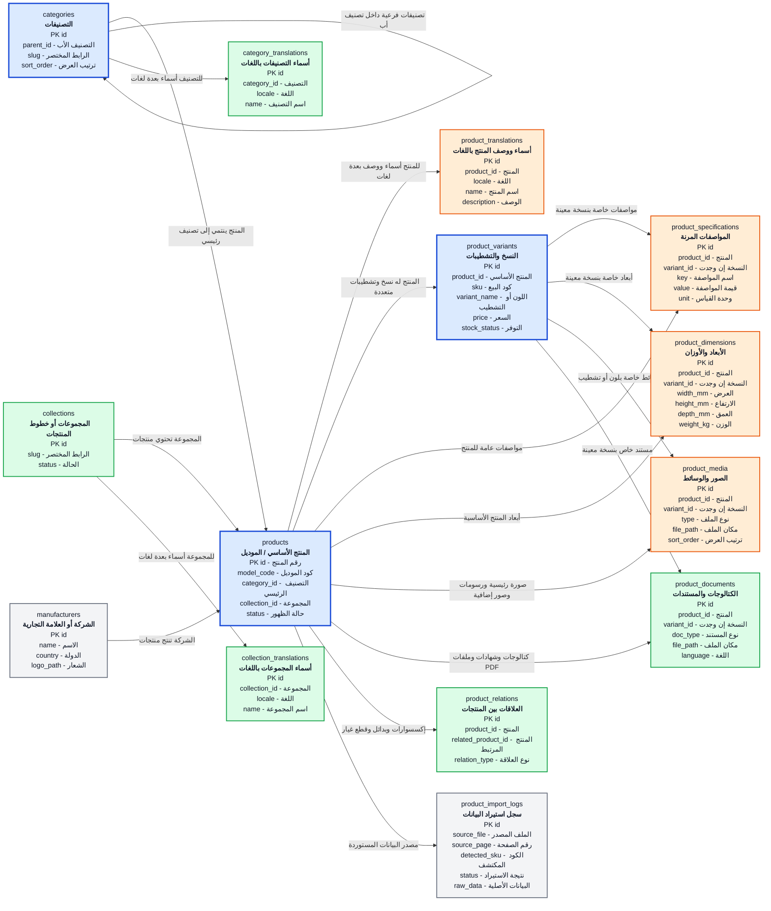
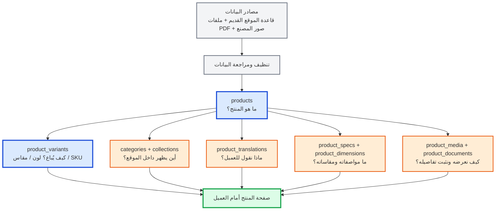

# مخطط قاعدة بيانات المنتجات

> هذه الرسمة تشرح الجزء الخاص بالكتالوج والمنتجات فقط.  
> أسماء الجداول والأعمدة مكتوبة بالإنجليزي حتى تكون مناسبة للبرمجة، بينما وصف كل جزء والعلاقات مكتوب بالعربي.

## الرسمة الرئيسية

### مفتاح الألوان

| اللون | المستوى | المعنى |
|---|---|---|
| أزرق | الأساس | لا يمكن بناء كتالوج المنتجات بدونه |
| برتقالي | مهم جدًا | البيانات التي يحتاجها العميل لفهم المنتج واختياره |
| أخضر | توسعة مفيدة | تضيف تنظيمًا واحترافية، ويمكن إضافتها بعد الأساس |
| رمادي | تشغيلي | يساعد الإدارة والاستيراد، لكنه ليس جزءًا أساسيًا من عرض المنتج |

> لو لم تظهر الألوان في المعاينة، افتح الملف من خلال Mermaid Live Editor أو استخدم إضافة Mermaid في VS Code؛ الرسمة نفسها ستظل مفهومة من خلال العناوين.

## تخيل النظام كرحلة منتج

### معنى الرحلة

1. **مصادر البيانات:** نأخذ المعلومات من قاعدة الموقع القديم والكتالوجات والصور.
2. **`products`:** ننشئ بطاقة للموديل نفسه، مثل خلاط أو مرآة أو وحدة حمام.
3. **`product_variants`:** نضيف ما يختلف في البيع، مثل اللون أو المقاس أو كود الـ SKU.
4. **التصنيف:** نحدد مكان المنتج في الموقع، مثل `Mixers` أو `Mirrors` أو `Vanity`.
5. **الوصف والترجمة:** نكتب الاسم والوصف بالعربي والإنجليزي.
6. **المواصفات والأبعاد:** نضيف الخامة والمقاسات وطريقة التركيب وغيرها.
7. **الصور والملفات:** نربط الصورة الأساسية والرسم الفني وصورة التركيب والكتالوج.
8. **صفحة المنتج:** الموقع يجمع كل هذه البيانات ويعرضها كصفحة واحدة للعميل.

## ما الذي نحتاجه أولًا؟

### المرحلة الأولى: قلب النظام

هذه هي الجداول التي يجب تنفيذها أولًا:

- `products`: تعريف الموديل.
- `product_variants`: الأكواد والألوان والمقاسات.
- `categories`: تصنيف المنتجات.

بدون هذه الجداول لا يوجد كتالوج منظم.

### المرحلة الثانية: جعل المنتج قابلًا للعرض

- `product_translations`: الاسم والوصف.
- `product_media`: الصورة الأساسية والرسم الفني وصور التركيب.
- `product_specs`: المواصفات المختلفة.
- `product_dimensions`: الأبعاد والأوزان.

هذه المرحلة هي التي تجعل صفحة المنتج مفيدة للعميل، وليست مجرد اسم وكود.

### المرحلة الثالثة: الاحتراف والتوسع

- `collections`: تنظيم المنتجات في خطوط أو مجموعات.
- `product_documents`: الكتالوجات والشهادات وملفات PDF.
- `product_relations`: الإكسسوارات والبدائل وقطع الغيار.
- `category_translations` و`collection_translations`: ترجمة التصنيفات والمجموعات.

### المرحلة التشغيلية

- `manufacturers`: مفيد إذا كان النظام سيضم أكثر من شركة أو علامة.
- `product_import_logs`: مهم أثناء نقل البيانات من الملفات القديمة، وليس مطلوبًا في صفحة العميل.

## كيف نقرأ التصميم؟

### 1. المنتج الأساسي والنسخ

جدول `products` يمثل **الموديل نفسه**، مثل: خلاط حوض موديل 1610.

جدول `product_variants` يمثل الاختلافات التي يتم بيعها أو عرضها بشكل منفصل، مثل:

- Chrome
- Gold
- Black
- مقاس 60 سم أو 80 سم

وبالتالي يمكن أن يكون عندنا منتج واحد له أكثر من `sku`، بدل تكرار بيانات المنتج والوصف والصور العامة.

### 2. التصنيفات والمجموعات

- `categories`: التصنيفات التي يتصفحها العميل، مثل خلاطات أو مرايا أو وحدات حمام.
- `collections`: مجموعة أو خط إنتاج أكبر، مثل Art أو Kids.
- `parent_id` داخل `categories`: يسمح بعمل تصنيف رئيسي وتصنيفات فرعية.
- جداول الترجمة تحفظ الاسم العربي والإنجليزي وأي لغة أخرى بدون تكرار سجل التصنيف نفسه.

### 3. اللغات

الجداول التالية تفصل المحتوى القابل للترجمة عن البيانات الفنية:

- `product_translations`: اسم المنتج ووصفه.
- `category_translations`: اسم التصنيف ووصفه إن احتجنا.
- `collection_translations`: اسم المجموعة ووصفها.

مثال: نفس المنتج له سجل `locale = ar` وسجل آخر `locale = en`.

### 4. المواصفات والأبعاد

- `product_specifications` للمواصفات التي تختلف من نوع منتج إلى آخر، مثل:
  - الخامة
  - نوع الكارتريدج
  - اللون
  - طريقة التركيب
  - عدد الفتحات
- `product_dimensions` للأرقام التي نحتاج البحث أو المقارنة بها:
  - العرض
  - الارتفاع
  - العمق
  - الوزن

وجود `variant_id` اختياري؛ فإذا كانت المواصفة عامة نربطها بالمنتج، وإذا كانت خاصة بلون أو مقاس معين نربطها بالنسخة.

### 5. الصور والملفات

كل الصور والوسائط تكون في `product_media`، ويحدد العمود `type` وظيفة الملف:

| `type` | الاستخدام |
|---|---|
| `main_image` | الصورة الأساسية للمنتج |
| `drawing` | الرسم الفني الذي يوضح الأبعاد والمقاسات |
| `installation` | صورة المنتج أثناء التركيب |
| `lifestyle` | صورة المنتج داخل حمام أو مكان جاهز |
| `gallery` | صور إضافية |
| `video` | فيديو أو صورة متحركة إن وجدت |
| `thumbnail` | صورة مصغرة للعرض السريع |

أما ملفات PDF والكتالوجات والشهادات فتكون في `product_documents`، مثل:

- `datasheet`: ورقة مواصفات المنتج.
- `installation_manual`: دليل التركيب.
- `certificate`: شهادة أو اعتماد.
- `cad`: ملف رسم هندسي.
- `catalogue`: كتالوج يغطي منتجًا أو مجموعة منتجات.

### 6. المنتجات المرتبطة

جدول `product_relations` يربط المنتجات ببعضها، مثل:

- إكسسوار مناسب للمنتج.
- قطعة غيار.
- منتج بديل.
- منتج يمكن عرضه معه.
- جزء من مجموعة أو طقم.

### 7. استيراد البيانات من الملفات القديمة

جدول `product_import_logs` ليس لعرض المنتجات للعميل. هو سجل داخلي يساعدنا أثناء نقل البيانات من:

- قاعدة بيانات الموقع القديم.
- ملفات PDF.
- صور المصنع.

يسجل الملف ورقم الصفحة والكود الذي تم اكتشافه ونتيجة المعالجة، حتى نعرف ما تم استيراده وما يحتاج مراجعة.

## أهم قاعدة في التصميم

الصورة الأساسية والرسم الفني وصورة التركيب ليست أعمدة ثابتة داخل جدول `products`. يتم تخزينها كلها في `product_media` مع تحديد نوع كل ملف في `type`.

بهذا الشكل:

- كل منتج يمكن أن يكون له صورة أساسية واحدة.
- يمكن أن يكون له أكثر من رسم فني.
- يمكن إضافة صور تركيب أو صور متحركة لاحقًا.
- يمكن إضافة أنواع جديدة من الوسائط بدون تعديل جدول المنتجات.

## الجداول الأساسية للنسخة الأولى

لو أردنا بدء التنفيذ بأقل عدد ضروري من الجداول، نبدأ بهذه الجداول:

1. `products`
2. `product_variants`
3. `categories`
4. `product_translations`
5. `product_specifications`
6. `product_dimensions`
7. `product_media`

ثم نضيف `collections` و`product_documents` و`product_relations` عندما نبدأ في إدخال بيانات الكتالوجات كاملة.
